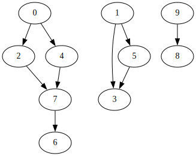
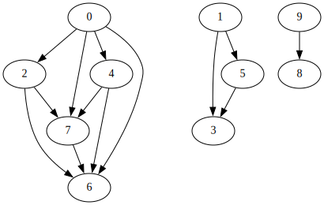

# Projet Graphe

Un besoin fréquent est de calculer les composantes connexes d'un graphe.
On trouve de très nombreux cas d'usage dans les données issues de l'internet : les liens entre les pages web qu'utilisent les moteurs de recherche, les relations entre utilisateurs de twitter (quels utilisateurs suivent quels autres), ... 
Calculer les composantes connexes permet d'identifier des communautés distinctes, qui n'ont pas de lien entre elles.
On se concentrera dans la suite sur les graphes orientés.

## Calcul des composantes connexes

Un moyen de calculer les composantes connexes consiste à calculer d'abord la **fermeture transitive** du graphe. Si on prend par exemple le graphe de la Fig. 1, on obtiendra le graphe de la Fig.2 après fermeture transitive.

<figure>

<figcaption>Fig.1 - Exemple de graphe avec 3 composantes connexes.</figcaption>
</figure>

Il est beaucoup plus simple de calculer les composantes connexes à partir de la fermeture transitive.

<figure>

<figcaption>Fig.2 - Graphe de la Fig. 1 avec fermeture transitive.</figcaption>
</figure>

>  Dans ce projet, on ne parallélisera que le calcul de fermeture transitive.

## Représentation du graphe

Pour les calculs, une représentation commode d'un graphe est la *matrice d'adjacence*. Dans cette matrice une valeur de $1$ en ligne $i$ et colonne $j$ indique l'existence d'une arrête du sommet $i$ vers le sommet $j$. Notre exemple de la Fig. 1 est représenté par la matrice d'adjacence suivante :

```
0 0 1 0 1 0 0 0 0 0
0 0 0 1 0 1 0 0 0 0
0 0 0 0 0 0 0 1 0 0
0 0 0 0 0 0 0 0 0 0
0 0 0 0 0 0 0 1 0 0
0 0 0 1 0 0 0 0 0 0
0 0 0 0 0 0 0 0 0 0
0 0 0 0 0 0 1 0 0 0
0 0 0 0 0 0 0 0 0 0
0 0 0 0 0 0 0 0 1 0
```

Les lignes et colonnes sont numérotées à partir de 0. Les arcs du sommet 0 se lisent sur la première ligne : il y a un 1 dans les colonnes 2 et 4, représentant les arcs entre les sommets `0->2` et `0->4`.

Un ensemble de matrices d'ajacence exemple sont fournies dans le répertoire `share/` dans les fichiers dont l'extension est `.adj`.

## Fermeture transitive

### Algorithme séquentiel

La version séquentielle livrée dans le fichier `graph.c` utilise l'algorithme de [Warshall](https://fr.wikipedia.org/wiki/Algorithme_de_Warshall). Il ressemble fortement à l'algorithme de plus court chemin Warshall-Floyd et a une complexité de $O(n^3)$ pour $n$ sommets.  

### Utilisation

#### Sur une matrice d'ajacence

Le `Makefile` livré produit l'exécutable `graph` et s'utilise comme ceci :

```bash
% ./graph -i share/10x10.adj -t adj
```

La sortie contient :

- les messages d'information, sortent sur `stderr`, 
- la matrice d'adjacence de la fermeture transitive sur `stdout`, 
  ce qui permet de récupérer cette matrice par une redirection, par exemple: 
  
  ```bash
  % ./graph -i share/10x10.adj -t adj > 10x10-tclos.adj
  ```

#### Sur une liste de paires

Pour faciliter des tests sur d'autres jeu de données, `graph`permet de lire un autre format d'entrée constitué de lignes comportant 2 entiers séparés par une tabulation. Une ligne comme `0  42` indique qu'il y un arc `0 -> 42`. Dans `share/` ces fichiers de données ont l'extension `.txt`.

Notez qu'une matrice d'ajacence de taille $n$ x $n$ est construite, où $n$ est l'entier le plus grand observé dans le fichier. 

### Visualisation

Le package [graphviz](https://graphviz.org) contient l'utilitaire `dot` pour dessiner des graphes dans de nombeux formats de sortie (pdf, png, svg, ....). Les Fig.1 et Fig.2 sont des exemples. Il prend en entrée une description de graphe qui peut être très simple avec le langage [dot](https://graphviz.org/doc/info/lang.html). 

Graphviz propose aussi l'utilitaire `ccomps` qui permet de calculer les composantes connexes d'un graphe représenté en dot (peut être utile pour vérifier).

Vous avez un programme `convert_adj_to_dot` qui permet de convertir une matrice d'adjacence en un fichier dot.

```bash
%  ./convert_adj_to_dot share/10x10.adj
* share/10x10.adj has 10 lines.
* about to write to share/10x10.adj.dot in dot format ... done.
%
% ccomps -s -v share/10x10.adj.dot
(   0)       5 nodes       5 edges
(   1)       3 nodes       3 edges
(   2)       2 nodes       1 edges
            10 nodes       9 edges       3 components %1
```

On peut dessiner le graphe représenté par le fichier `.dot` avec la commande `dot`de graphviz, dans différents formats.
Par exemple pour générer un PDF:
```bash
% dot -Tpdf share/10x10.adj.dot > 10x10.adj.dot.pdf
```

## Travail à faire

Le travail est à faire en binome.

Le travail consiste à paralléliser l'algorithme de fermeture transitive en utilisant tout ce que vous savez faire (MPI, OpenMP).
Vous pouvez utiliser les idées de l'article [1] pour cette parallélisation.

Vous devrez rendre une archive `projet_2223.tar.gz` contenant:
- un fichier `README.md` (format markdown) comportant :
    + les 2 noms étudiants
    + un paragraphe d'explications indiquant les difficultés rencontrées et l'idée de votre parallélisation en la justifiant.
    + des mesures de performances (en indiquant la plateforme matéreielle utilisée)
  
- les codes source (votre version parallélisée sera dans un fichier `graph_par.c`) et le Makefile 
- ne laissez pas de gros jeux de tests dans votre archive mais modifiez le Makefile pour générer les jeux de données utilisés.

## Note sur le Makefile

Lisez le ! Il faut modifier la variable `CC` pour utiliser le compilateur que vous souhaitez. Le `Makefile` livré génére le binaire `graph` et `graph_par`. Vous n'avez pas `graph_par.c` au début bien sûr.

Des matrices d'ajacence peuvent être produites avec le script python `gen_adj.py`. Il prend deux paramètres : le nombre total de sommets, et le nombre de composantes connexes qu'on veut avoir dans la matrice d'ajacence. Dans le Makefile, des *cibles* (*targets*) existent déjà comme `gen-data-1000`.

Vous pouvez utiliser tout de suite la cible `test-seq` qui déclenche la génération d'un jeu de donnée et l'exécution de `graph` sur ce jeu de données.

## Bibliographie

[1] Alves, C.E.R., Cáceres, E.N., de Castro, A.A. et al. Parallel transitive closure algorithm. J Braz Comput Soc 19, 161–166 (2013). https://doi.org/10.1007/s13173-012-0089-z
